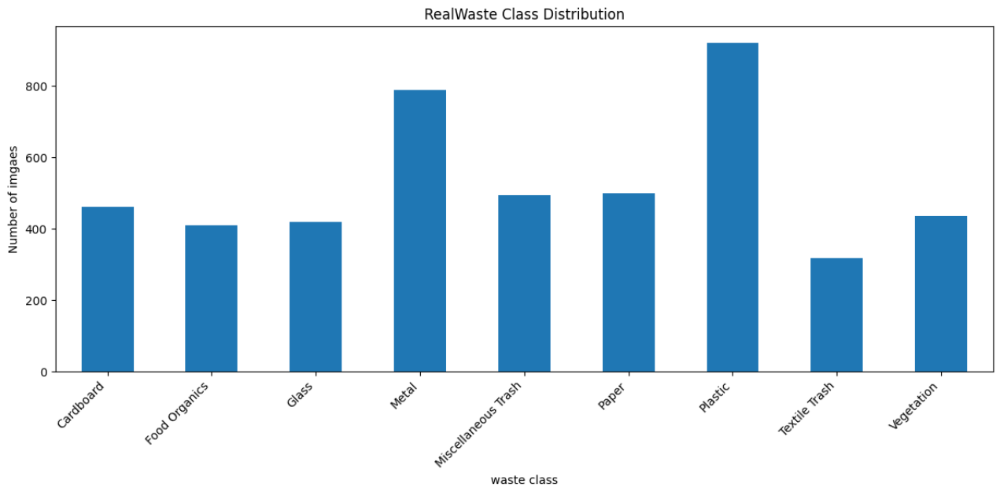
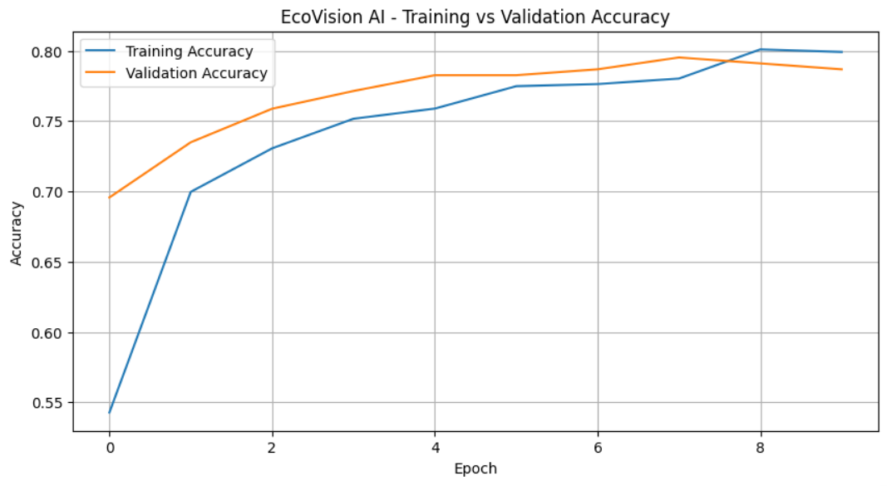
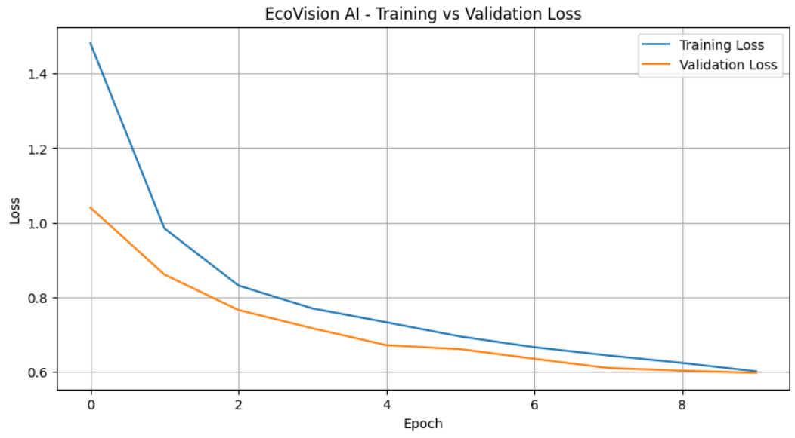
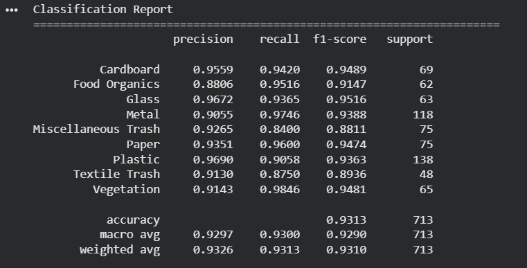
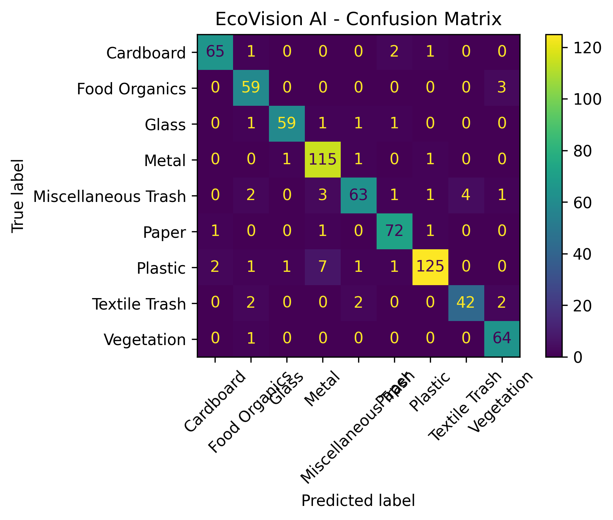
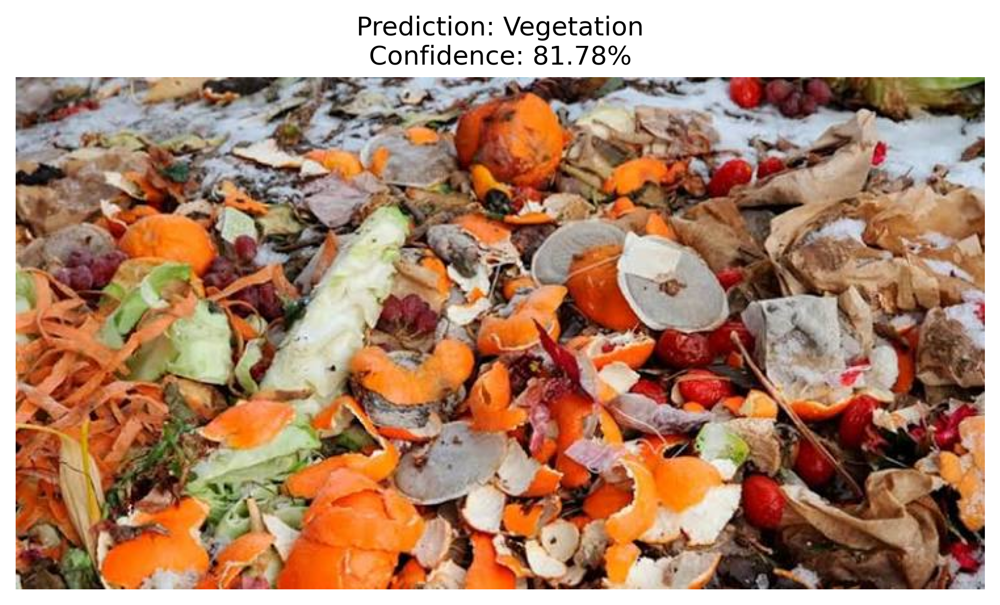
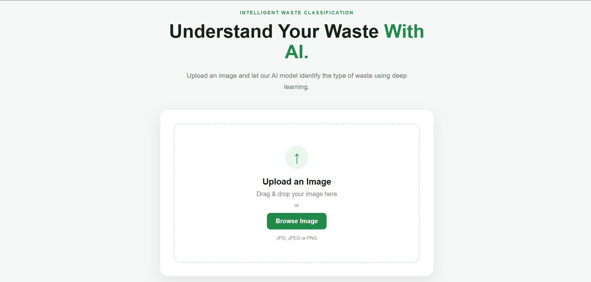
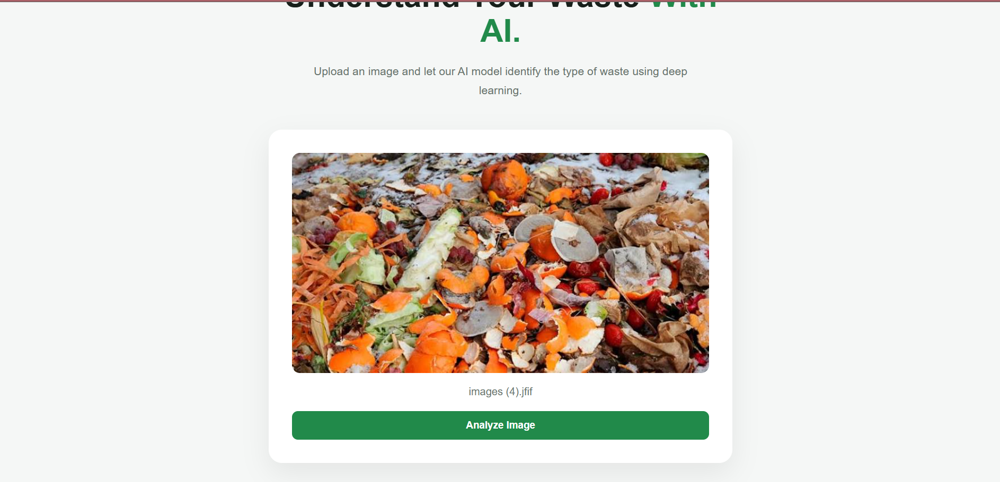
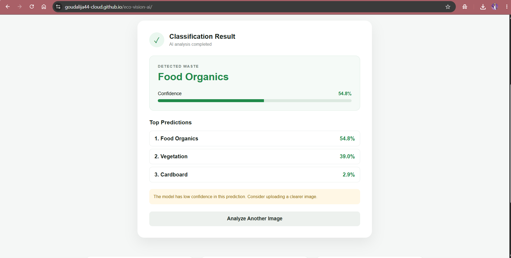

# 🌱 EcoVision AI — Intelligent Waste Classification System

**EcoVision AI** is an end-to-end deep learning application that uses **computer vision and transfer learning** to classify waste images into different categories.

The system uses **EfficientNet-B0** trained on the **RealWaste dataset** and provides predictions through a **FastAPI backend** and a professional web interface built with **HTML, CSS, and JavaScript**.

Users can upload a waste image, and EcoVision AI analyzes the image and returns the predicted waste category, confidence score, and top-3 predictions.

---

## 🚀 Live Demo

### 🌐 Web Application

**https://goudalija44-cloud.github.io/eco-vision-ai/**

### ⚡ FastAPI Backend

**https://eco-vision-ai-api.onrender.com**

### 💻 GitHub Repository

**https://github.com/goudalija44-cloud/eco-vision-ai**

---

## 📌 Project Overview

Waste segregation is an important part of effective recycling and waste management. However, identifying different types of waste manually can be difficult and time-consuming.

EcoVision AI addresses this problem using **deep learning-based image classification**.

The system accepts an image as input and performs the following process:

```text
User uploads image
        ↓
Web Frontend
        ↓
FastAPI REST API
        ↓
Image Validation
        ↓
Image Preprocessing
        ↓
EfficientNet-B0
        ↓
Probability Prediction
        ↓
Top-3 Predictions
        ↓
Prediction + Confidence
```

---

## ✨ Key Features

* ♻️ AI-powered waste image classification
* 🧠 EfficientNet-B0 transfer learning
* 🖼️ Image upload and preview
* ⚡ FastAPI REST API
* 📊 Confidence score
* 🔝 Top-3 predictions
* ⚠️ Low-confidence prediction handling
* 🌐 Publicly deployed web application
* 📱 Responsive frontend
* 🔬 Model evaluation using accuracy, precision, recall and F1-score
* 📈 Confusion matrix and classification report
* 🧪 Separate training, validation and test datasets

---

## 🧠 Machine Learning

### Model

**EfficientNet-B0**

The model uses transfer learning with ImageNet-pretrained weights.

The original classifier was replaced with a custom classification layer for the **9 RealWaste categories**.

### Training Strategy

The model was trained in two stages.

#### Stage 1 — Feature Extraction

The pretrained EfficientNet-B0 feature extractor was frozen while the classification layer was trained.

#### Stage 2 — Fine-Tuning

The final layers of the EfficientNet-B0 feature extractor were unfrozen and fine-tuned using a smaller learning rate.

This allows the model to adapt pretrained visual features to the waste classification problem.

---

## ♻️ Waste Categories

The RealWaste dataset contains 9 waste categories:

1. Cardboard
2. Food Organics
3. Glass
4. Metal
5. Miscellaneous Trash
6. Paper
7. Plastic
8. Textile Trash
9. Vegetation

---

## 📊 Dataset

This project uses the **RealWaste dataset** from the UCI Machine Learning Repository.

Dataset characteristics:

* **4,752 real-world waste images**
* **9 classes**
* Images collected in a landfill environment
* Original image resolution: approximately 524 × 524
* Used for multi-class image classification

Dataset source:

**UCI Machine Learning Repository — RealWaste**

---

## 🔄 Image Preprocessing

Images are resized to:

```text
224 × 224
```

Training images use data augmentation:

* Random horizontal flipping
* Random rotation
* Brightness adjustment
* Contrast adjustment
* Saturation adjustment

Images are normalized using ImageNet normalization:

```python
mean = [0.485, 0.456, 0.406]

std = [0.229, 0.224, 0.225]
```

---

## 📈 Model Performance

The final model was evaluated on the held-out test dataset.

| Metric        |      Score |
| ------------- | ---------: |
| Test Accuracy | **89.20%** |
| Precision     | **89.81%** |
| Recall        | **89.78%** |
| F1 Score      | **89.70%** |

These results were obtained from the final test evaluation of the fine-tuned EfficientNet-B0 model.

---

## 🔬 Model Evaluation

The project includes multiple evaluation methods:

### Classification Report

The classification report evaluates:

* Precision
* Recall
* F1-score
* Support
* Accuracy
* Macro average
* Weighted average

### Confusion Matrix

A 9 × 9 confusion matrix is used to analyze correct and incorrect predictions across all waste categories.

### New Image Prediction

The trained model can also classify previously unseen images and return the top-3 predicted classes with their confidence scores.

---

## 🏗️ Project Structure

```text
eco-vision-ai/
│
├── model/
│   ├── ecovision_efficientnet_b0.pth
│   ├── class_names.json
│   └── model_config.json
│
├── notebook/
│   └── EcoVision_AI_Waste_Classification.ipynb
│
├── index.html
├── style.css
├── script.js
│
├── app.py
├── inference.py
├── requirements.txt
├── .python-version
├── .gitignore
└── README.md
```

---

## 📓 Jupyter Notebook

The notebook contains the complete machine learning workflow:

```text
Dataset Loading
      ↓
Exploratory Data Analysis
      ↓
Class Distribution
      ↓
Train / Validation / Test Split
      ↓
Image Preprocessing
      ↓
Data Augmentation
      ↓
EfficientNet-B0
      ↓
Transfer Learning
      ↓
Fine-Tuning
      ↓
Model Evaluation
      ↓
Classification Report
      ↓
Confusion Matrix
      ↓
New Image Prediction
      ↓
Production Model
```

---

## ⚙️ Backend

The backend is developed using **FastAPI**.

### API Endpoints

| Endpoint      | Method | Description             |
| ------------- | ------ | ----------------------- |
| `/`           | GET    | API information         |
| `/health`     | GET    | Health check            |
| `/model-info` | GET    | Model information       |
| `/predict`    | POST   | Classify uploaded image |

### Example Prediction Response

```json
{
    "filename": "plastic_bottle.jpg",
    "prediction": "Plastic",
    "confidence": 0.94,
    "top_predictions": [
        {
            "class": "Plastic",
            "confidence": 0.94
        },
        {
            "class": "Miscellaneous Trash",
            "confidence": 0.03
        },
        {
            "class": "Glass",
            "confidence": 0.01
        }
    ]
}
```

---

## 🌐 Frontend

The frontend is built using:

* HTML5
* CSS3
* JavaScript

The interface provides:

* Image upload
* Drag-and-drop support
* Image preview
* Loading state
* AI prediction
* Confidence percentage
* Confidence progress bar
* Top-3 predictions
* Low-confidence warning
* Analyze another image option
* Responsive design

No React or Next.js is used in this project.

---

## 🛠️ Technologies Used

### Machine Learning

* Python
* PyTorch
* TorchVision
* EfficientNet-B0
* Scikit-learn

### Data Processing

* NumPy
* Pandas
* PIL

### Backend

* FastAPI
* Uvicorn
* Python Multipart

### Frontend

* HTML
* CSS
* JavaScript

### Deployment

* GitHub
* GitHub Pages
* Render

---

## 💻 Run Locally

### 1. Clone the repository

```bash
git clone https://github.com/goudalija44-cloud/eco-vision-ai
cd eco-vision-ai
```

### 2. Create a virtual environment

Windows:

```bash
py -m venv .venv
```

Activate it:

```bash
.venv\Scripts\activate
```

### 3. Install dependencies

```bash
py -m pip install -r requirements.txt
```

### 4. Start the FastAPI server

```bash
py -m uvicorn app:app --reload
```

The API will run locally at:

```text
http://127.0.0.1:8000
```

Swagger documentation:

```text
http://127.0.0.1:8000/docs
```

---

## 🧪 Testing the API

The Swagger interface can be used to test the `/predict` endpoint.

Open:

```text
http://127.0.0.1:8000/docs
```

Then:

1. Open `POST /predict`
2. Click **Try it out**
3. Upload an image
4. Click **Execute**
5. View the prediction and confidence scores

---

## 📸 Project Screenshots

### Dataset Distribution



Distribution of images across the 9 waste categories in the RealWaste dataset.

---

### Training Accuracy



Training and validation accuracy throughout model training and fine-tuning.

---

### Training Loss



Training and validation loss throughout the training process.

---

### Classification Report



Detailed precision, recall, F1-score, and support for each waste category.

---

### Confusion Matrix



Confusion matrix showing correct and incorrect predictions across all 9 waste categories.

---

### Colab Model Prediction



Prediction generated by the trained EfficientNet-B0 model in Google Colab.

---

### Live Demo



EcoVision AI public web application.

---

### Uploaded Image



Example waste image uploaded for classification.

---

### Live Prediction Result



Prediction result generated through the deployed EcoVision AI application.

---

## 📁 Screenshots Directory

```text
screenshots/
├── accuracy_graph.png
├── classifiation_report.png
├── colab_prediction.png
├── confusion_matrix.png
├── dataset_distribution.png
├── live_demo.png
├── live_result.png
├── loss_graph.png
└── uploaded_img.png
```


## 🔐 Model Confidence

EcoVision AI returns the probability of the predicted classes.

The application uses a confidence threshold to identify predictions where the model may not be sufficiently confident.

This helps avoid presenting uncertain predictions as completely reliable classifications.

The threshold is configurable through:

```text
model/model_config.json
```

---

## 🔮 Future Improvements

Possible future improvements include:

* Object detection for multiple waste items in one image
* Larger and more diverse waste datasets
* Real-time camera classification
* Mobile application
* Explainable AI using Grad-CAM
* Waste disposal recommendations
* Recycling instructions
* Multi-language support
* Continuous model improvement using additional real-world images
* Model quantization for faster inference
* Docker-based deployment
* Automated CI/CD testing

---

## 🎯 Learning Outcomes

Through this project, I worked with:

* Computer vision
* Image preprocessing
* Data augmentation
* Transfer learning
* EfficientNet
* Fine-tuning
* Multi-class classification
* Model evaluation
* Confusion matrices
* Classification reports
* PyTorch model serialization
* REST API development
* FastAPI
* Frontend-backend integration
* API deployment
* GitHub Pages deployment
* Cloud deployment with Render

---

## 👩‍💻 Project

**EcoVision AI — Intelligent Waste Classification System**

An end-to-end AI/ML project demonstrating the complete workflow from **dataset preparation and deep learning model training to API development and public web deployment**.
